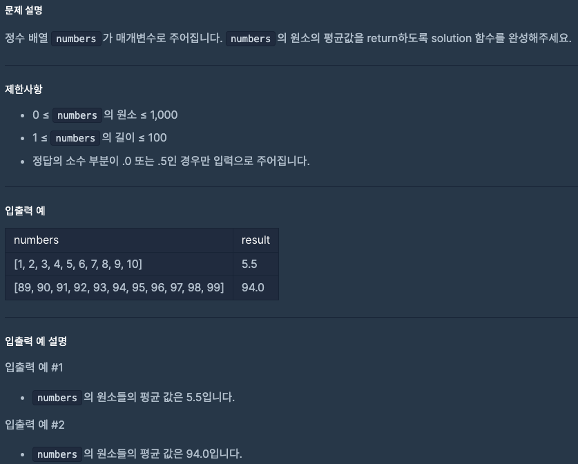
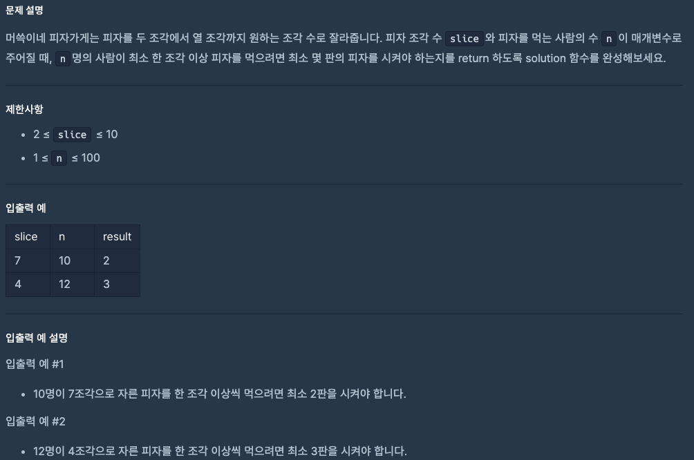

# 0809 공부내용

## 매일매일 1일 면접 대비

### __클로저에 대해서 설명해주세요.___

-> 클로저란 함수가 선언될 떄의 스코프를 기억하여, 함수가 생성된 이후에도 그 스코프에 접근할 수 있는 기능이다.

비유하자면, 함수가 자신이 생성된 환경을 기억하는 것이라고 할 수 있습니다. 클로저는 자바스크립트의 함수가 일급 객체라는 특성과 렉시컬 스코프의 조합으로 만들어집니다.

__클로저 예시 코드__

```
function outerFunction(outerVariable) {
  return function innerFunction(innerVariable) {
    console.log('Outer Variable: ' + outerVariable);
    console.log('Inner Variable: ' + innerVariable);
  };
}

const newFunction = outerFunction('outside');
newFunction('inside');
```

innerFunction은 outerFunction의 내부에 정의 되어 있습니다. innerFunction은 자신이 생성된 스코프, 즉 outerFunction의 스코프를 기억하고, outerFunction의 호출이 완료된 이후에도 그 스코프에 접근할 수 있습니다. 그리고 이에 따라 innerFunction은 outerVariable에도 접근할 수 있습니다. 이것이 클로저가 동작하는 방식입니다.


### 그렇다면 클로저는 언제 활용하나요?
-> 클로저는 변수와 함수의 접근 범위를 제어하고 특정 데이터와 상태를 유지하기 위해 자주 활용됩니다.

1. 데이터 은닉에 활용 : 클로저는 외부에서 접근할 수 없는 비공개 변수와 함수를 만들 수 있습니다. 이를 통해 데이터를 은닉하여 외부 접근을 막고, 데이터 무결성을 유지할 수 있습니다.
예를 들어, 특정 함수 내부에서만 접근 가능한 변수를 생성, 이를 조작할 수 있는 함수만 노출하여 안전하게 데이터를 관리할 수 있습니다.

2. 비동기 작업에 활용됩니다. 클러저는 비동기 작업에서 이전의 실행 컨텍스트를 유지해야 할 때 유용합니다. 콜백 함수가 비동기적으로 실행될 때 클로저를 사용하면 함수 실행 시점의 변수를 참조할 수 있습니다.
```
function createLogger(name) {
  return function() {
    console.log(`Logger: ${name}`);
  };
}

const logger = createLogger('MyApp');
setTimeout(logger, 1000); // 1초 후에 'Logger: MyApp' 출력
```

3. 모듈 패턴을 구현하는 데 활용됩니다. 모듈 패턴은 특정 기능을 캡슐화하고, 외부에 공개하고자 하는 부분만 선택적으로 노출하여 코드의 응집력을 높이고, 유지보수성을 향상시키는 패턴입니다. 클로저를 활용하면 필요한 함수와 데이터만 외부로 노출함으로써 모듈 패턴을 쉽게 구현할 수 있습니다.

## 오늘의 알고리즘 문제

#### 1번 문제


풀이:
```
function solution(numbers) {
  let sum = 0;

  for (let i = 0; i < numbers.length; i++) {
    sum += numbers[i]; //합계구하기
  }

  let average = sum / numbers.length;
  return average;
}
```

풀이해석:
sum += numbers[i];로 배열의 모든 수를 더하고,
average = sum / numbers.length;로 평균을 구한다.
정답의 소수부분이 .0 또는 .5인 경우만 입력으로 주어진다 했으니
정수로 바꿔줄 필요는 없다.


### 2번 문제


풀이:
```
function solution(slice, n) {
  let pizzas = 0; // 시킨 피자 판 수를 저장하는 변수

  for (let i = 1; ; i++) { // i는 1부터 시작해서 무한히 증가
    if (slice * i >= n) {  // i판을 시켰을 때 총 조각 수가 사람 수 이상이면
      pizzas = i;          // 필요한 피자 판 수는 i
      break;               // 조건을 만족했으니 반복문 종료
    }
  }

  return pizzas; // 최종적으로 계산된 피자 판 수 반환
}
```

풀이해석: 시켜야하는 피자의 판 수를 담는 pizzas 변수를 만들어주고
for문을 활용하여 조건문 if를 만족하면 break가 나도록 했다.
i판을 시켰을 때 총 조각 수가 사람 수보다 많으면 (slice * i >=n) 필요한 판수는 pizzas = i;

## 오늘의 main 공부

__JavaScript의 배열__

