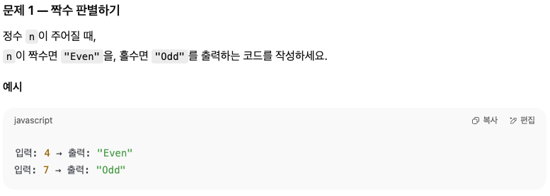
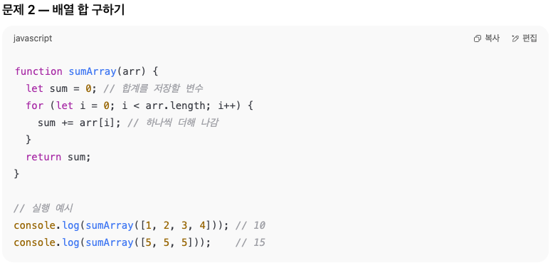

# 0809 공부내용 📖

## 매일매일 1일 면접 대비

### __reflow와 repaint의 차이점.___
__reflow__ 와  __repaint__ 는. 웹페이지가 렌더링 되는 과정에서 발생하는 작업들이다.


-reflow란? : 브라우저가 페이지의 레이아웃을 다시 계산하는 과정, DOM구조가 변경되거나 CSS 스타일이 변경되면, 브라우저는 각 요소가 화면에 어떻게 배치될지 다시 계산해야한다. 이 과정은 모든 자식 요소가 관련된 부모 요소까지 영향을 주고 또한 reflow가 발생하면 repaint도 다시 발생하기 때문에 비용이 많이 드는 작업이다.  ex) 크기 관련 속성 (width, height등), 위치 관련 속성 (position, top, left등), 레이아웃 관련 속성 (display, flex 관련 속성 등), 폰트 크기 관련 속성 (font-size, font-weight 등)

-repaint란? : 요소의 모양이나 스타일이 변경될 때 발생, 요소의 레이아웃은 그대로이고, 색상이나 배경등의 스타일만 변경되는 경우 ex) 색상 관련 속성 (color, bg-color 등), 테두리 관련 속성 (border-color, border-radius 등)

이 경우 브라우저는 요소의 모양만 다시 그리면 되기 때문에 reflow보다는 비용이 덜 들지만, 여전히 성능에 영향을 줄 수 있다.

즉, reflow는 __레이아웃을 다시 계산하는 과정__ 이고 repaint는 __계산 결과를 다시 그리는 과정__ 이라고 할 수 있다.

### 둘을 잘 관리하면 최적화에 도움이 되는데, 최적화 방법에는 무엇이 있을까?

- reflow를 유발하는 CSS속성 사용을 최소화 할 것. -> width, height, margin, padding 등의 속성은 요소의 레이아웃을 다시 계산하게 되므로 reflow를 일으킨다. 가능한 한 미리 CSS에서 스타일을 설정해 초기 로드시에만 계산이 이루어지도록 하고, 이후에는 변경하지 않는 것이 좋다.

- CSS 애니메이션 최적화 -> __transfer__ 와 __opacity__ 속성만을 사용하는것이 성능에 유리, 이 두 속성은 GPU 가속을 사용할 수 있어 reflow를 일으키지 않고 repaint만 발생시키므로 CPU자원을 적게 사용한다.

- will-change 속성 사용하기 -> __will-change__ 속성을 사용하여 브라우저에게 특정 요소가 변경될 것이라고 미리 언질을 줄 수 있다. 하지만 너무 자주사용하면 메모리 낭비가 발생하므로 필요한 요소에만 사용해야한다.

- DOM업데이트를 하나로 묶어 batch update하는 방법

## 오늘의 알고리즘 문제

#### 1번 문제


```
function evenOdd {
  if (n % 2 === 0) {
    return "Even";
  } else {
    return "Odd";
  }
}

변수 n을 2로 나눠서 나머지가 0이 되면 Even을 반환 나머지가 0이 아니라면 Odd를 반환하는 함수를 만들었다.

console.log(evenOdd(10));
console.log(evenOdd(7));
```

### 2번 문제


function sumArray(arr) {
  let sum = 0;
  for (let i = 0; i < arr.length; i++) {
    sum += arr[i];
  }
  return sum;
}

합계를 저장할 변수 sum을 만들어주고 반복문 for를 활용해 배열의 인덱스 값을 해줄 변수 i를 선언, i가 변수의 index값이 되어주고
sum이 재할당 되고 조건부분의 i값이 배열의 length값 보다 작아지면 조건문이 끝나도록 작성했다.


## 오늘의 main 공부
